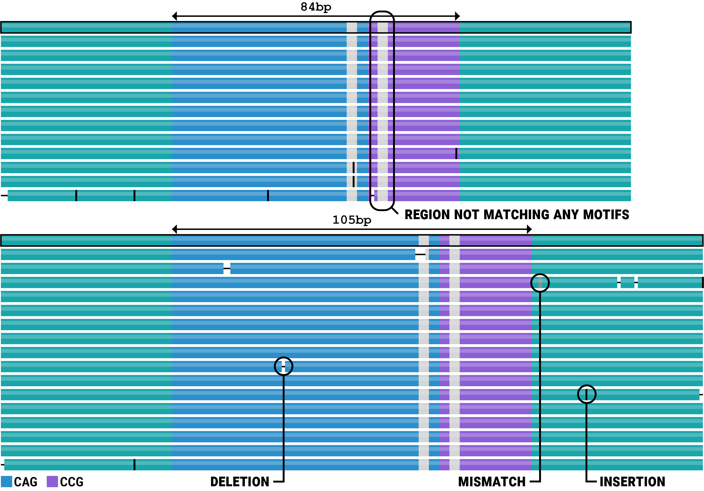
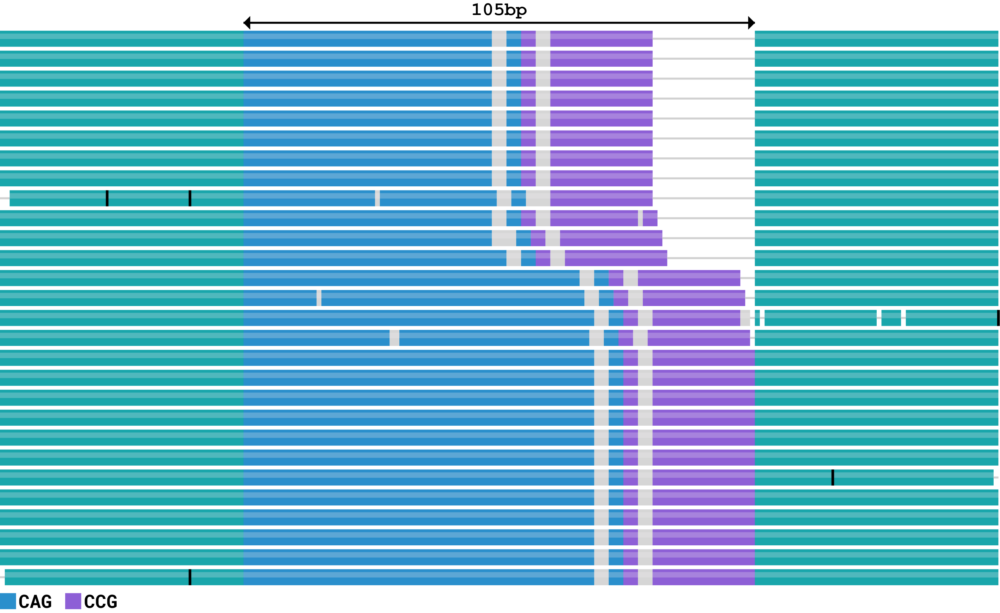

# Interpreting TRGT plots

In this tutorial, you will learn how to interpret the read pileup plots
generated by TRGT.

## Summary

- Create allele plots that depict repeat alleles and reads aligning to them
  (`--plot-type allele`, default).
- Create waterfall plots that depict portions of HiFi reads spanning the repeat
  without aligning them (`--plot-type waterfall`). The waterfall plots are
  especially convenient for visualizing mosaicism.
- Color code the repeat structure on allele and waterfall plots
  (`--show motifs`, default).
- Display 5mCpG methylation levels on allele and waterfall plots (`--show meth`).
- Horizontally compress plots for high coverage targeted data (`--squished`)

## An HTT repeat in the HG002 sample

This example concerns a repeat region in the *HTT* gene. This region contains
two tandem repeats, one consists of CAGs and the other consists of CCGs. The
expansions of the CAG repeat cause Huntington's disease.

The "allele plot" below consists of two panels, each corresponding to an allele
of this region. The first track of each panel depicts consensus sequence of the
corresponding allele. The CAG and CCG repeats are shown in blue and purple
respectively. The unsegmented regions (regions not matching to either CAG or CCG
motifs) are shown in light gray. (Deletions and insertions in the allele sequence
relative to the perfect, uninterrupted repeat are also shown when they are
present.) Subsequent tracks depict alignments of HiFi reads to the consensus
allele sequence. Any mismatches, insertions, and deletions are indicated by gray
bars, vertical lines, and horizontal lines respectively.

The "waterfall plot" below depicts the same set of reads as the allele plot
above. It shows portions of reads spanning the repeat region without aligning
them. The perfect copies of the CAG and CCG motifs are depicted in blue and
purple respectively. The remaining portions of the read sequences are colored in
light gray.

