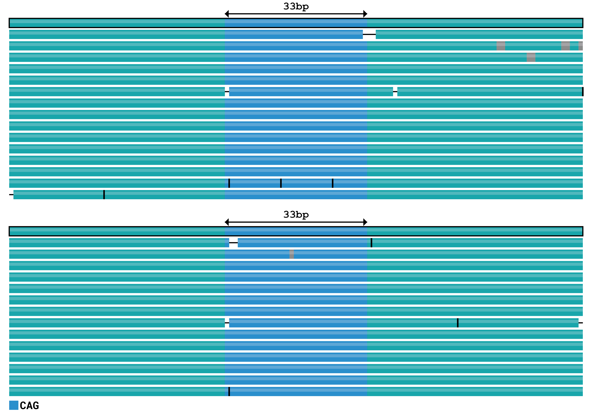

# Introductory tutorial

In this tutorial, you will learn the basics of TRGT by analyzing a
tiny example dataset included in this repository.

## Prerequisites

- Download the [latest TRGT binary](https://github.com/PacificBiosciences/trgt/releases)
- Download the [tiny example dataset](https://github.com/PacificBiosciences/trgt/tree/main/example)
- Install recent versions of `samtools` and `bcftools`

## Overview of the input files

Our example dataset consists of a reference genome (`reference.fasta`), a file
with aligned reads (`sample.bam`), and the repeat definition file
(`repeat.bed`). The repeat definitions are stored in a BED file that, contains
repeat coordinates, repeat identifiers, and motifs (the `STRUC` field can be
always set to value `<TR>`).

```bash
$ cat repeat.bed
chrA    10000    10061    ID=TR1;MOTIFS=CAG;STRUC=<TR>
```

## Genotype repeats

To genotype the repeat, run:

```bash
./trgt genotype --genome example/reference.fasta \
       --repeats example/repeat.bed \
       --reads example/sample.bam \
       --output-prefix sample
```

The output consists of files `sample.vcf.gz` and `sample.spanning.bam`. The VCF
file contains repeat genotypes while the BAM file contains portions of HiFi
reads that fully span the repeat sequences.

For example, here is the first entry of the VCF file:

```bash
$ bcftools view --no-header sample.vcf.gz | head -n 1
#CHROM  POS  ID  REF  ALT  QUAL  FILTER  INFO  FORMAT  sample
chrA  10001  .  CCAGCAGCAGCAGCAGCAGCAGCAGCAGCAGCAGCAGCAGCAGCAGCAGCAGCAGCAGCAG   CCAGCAGCAGCAGCAGCAGCAGCAGCAGCAGCAG  .  .  TRID=TR1;END=10061;MOTIFS=CAG;STRUC=<TR>  GT:AL:ALLR:SD:MC:MS:AP:AM  1/1:33,33:30-39,33-33:15,14:11,11:0(0-33),0(0-33):1.000000,1.000000:.,.
```

TRGT adds a padding base to each repeat allele (the first base of the allele
sequence). After excluding this padding base, we see that:

- There is a tandem repeat starting at position 10001 of chrA
- The reference sequence of this repeat is CAGCAGCAGCAGCAGCAGCAGCAGCAGCAGCAGCAGCAGCAGCAGCAGCAGCAGCAGCAG
- This repeat has two identical alleles CAGCAGCAGCAGCAGCAGCAGCAGCAGCAGCAG consisting of 11 CAGs each

## Sort and index the outputs

The outputs of TRGT are not sorted. So you need to sort and index the VCF:

```bash
bcftools sort -Ob -o sample.sorted.vcf.gz sample.vcf.gz
bcftools index sample.sorted.vcf.gz
```

and then the BAM:

```bash
samtools sort -o sample.spanning.sorted.bam sample.spanning.bam
samtools index sample.spanning.sorted.bam
```

And that's it! The output files are now ready for downstream analysis.

## Visualize a repeat

To visualize the repeat with the identifier "TR1", run:

```bash
./trgt plot --genome example/reference.fasta \
       --repeats example/repeat.bed \
       --vcf sample.sorted.vcf.gz \
       --spanning-reads sample.spanning.sorted.bam \
       --repeat-id TR1 \
       --image TR1.svg
```

TRGT outputs a file `TR1.svg` that contains the read pileup image. Note that the
SVG file can be directly edited in vector graphics editing software like
[Inkscape](https://inkscape.org/).

The resulting pileup plot shows the sequences of reads spanning each repeat
allele (blue) and the surrounding flanking sequence (green):


