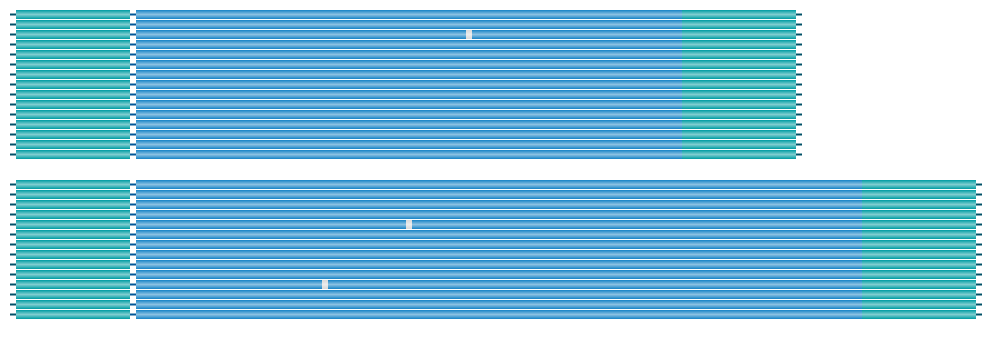

# Introductory tutorial

This tutorial describes the basics of TRGT and TRVZ tools.

## Prerequsites

- [Tiny example dataset](https://github.com/PacificBiosciences/trgt/example/)
  included in this repository
- Recent versions of `samtools` and `bcftools`

## Input files

Our example dataset consists of a reference genome (`reference.fasta`),
a file with aligned reads (`sample.bam`), and a list of repeats (`repeats.bed`).
The list of repeats is a BED file that, among other information, contains repeat
coordinates, repeat identifiers, and motifs:

```bash
$ cat repeats.bed
chrA   26039021        26039053        ID=chr10_26039021_26039053,STRUC=(TTTG)n
chrA   26041338        26041362        ID=chr10_26041338_26041362,STRUC=(TTG)n
chrA   26041683        26041699        ID=chr10_26041683_26041699,STRUC=(AAAC)n
```

## Genotyping repeats

This command will genotype the tandem repeats in our example dataset:

```bash
./trgt example/reference.fasta \
       example/sample.bam \
       example/repeats.bed \
       output
```

The output consists of files `output.bcf` and `output.spanning.bam`. The BCF
file (which binary version of a VCF file) contains repeat genotypes while the
BAM file contains pieces of HiFi reads that fully span the repeat sequences.

For example, here is the first entry of the BCF file:

```bash
$ bcftools view --no-header output.bcf | head -n 1
#CHROM POS ID REF ALT QUAL FILTER INFO FORMAT sample
chrA 3001 . CAGCAGCAGCAGCAGCAG CAGCAGCAGCAGCAGCAGCAGCAGCAGCAGCAGCAGCAGCAGCAGCAGCAGCAGCAGCAGCAGCAGCAGCAGCAGCAGCAGCAGCAGCAG,CAGCAGCAGCAGCAGCAGCAGCAGCAGCAGCAGCAGCAGCAGCAGCAGCAGCAGCAGCAGCAGCAGCAGCAGCAGCAGCAGCAGCAGCAGCAGCAGCAGCAGCAGCAGCAGCAGCAGCAG 0 . TRID=StrA GT 1/2
```

It says that there is a tandem repeat starting at position 3001 of chrA with
reference sequence CAGCAGCAGCAGCAGCAG. However in our sample this repeat has two
non-reference alleles. The first allele consists of 30 copies of CAG and the
second allele consists of 40 copies of CAG.

TRGT outputs are not sorted. So we first sort and index the BCF:
```bash
bcftools sort -Ob -o sample.sorted.bcf sample.bcf
bcftools index sample.sorted.bcf
```

and then the BAM:

```bash
samtools sort -o sample.spanning.sorted.bam sample.spanning.bam
samtools index sample.spanning.sorted.bam
```

And that's it! The output files are now ready for downstram analysises.

## Visualing repeats

Finally, let's visualize the repeat with the identifier "StrA" using TRVZ tool:

```bash
./trvz reference.fasta \
       sample.spanning.sorted.bam \
       sample.sorted.bcf \
       sample.spanning.sorted.bam \
       StrA
```

TRVZ outputs two files `StrA.svg` and `StrA.png` that contain the same read
pileup image in two file formats. Note that the SVG file can be directly edited
in vector graphics editing software like [Inscape](https://inkscape.org/).

The resulting pileup plot shows the sequences of reads spanning each repeat
allele (blue) and the surrounding flanking sequence (green):


