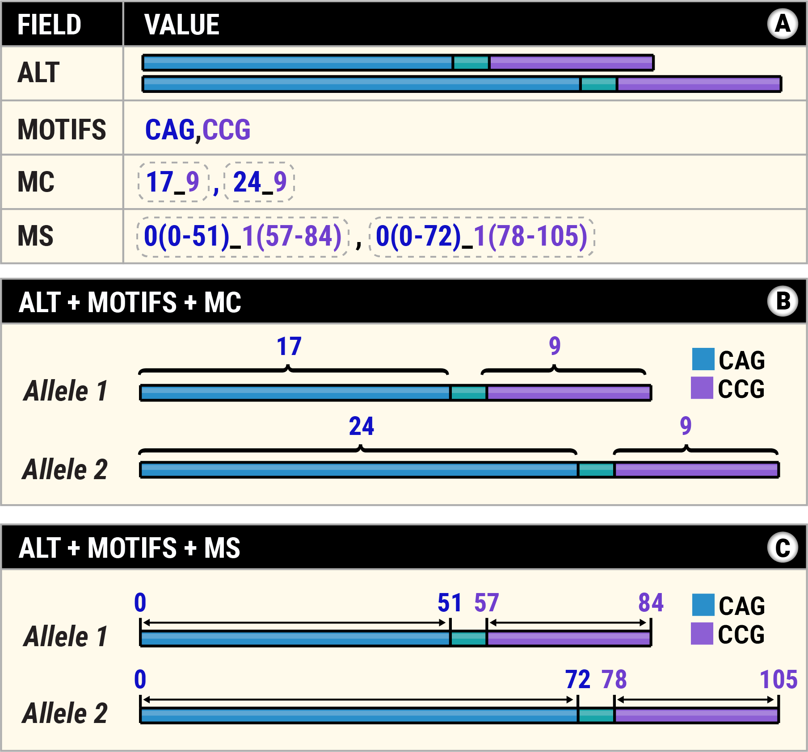

# Description of VCF files generated by TRGT

The [Variant Calling Format (VCF)](https://samtools.github.io/hts-specs/VCFv4.3.pdf)
files generated by TRGT describe the lengths, sequence composition, CpG
methylation, and other properties of tandem repeats (TRs). Each entry
consists of the fields described in the table below.

| VCF field | Description                                                   |
|-----------|---------------------------------------------------------------|
| CHROM     | Chromosome containing the repeat region                       |
| POS       | Starting position of the repeat region                        |
| ID        | Region identifier (currently set to ".")                      |
| REF       | The full reference sequence of the region                     |
| ALT       | Sequences of the repeat alleles                               |
| QUAL      | Currently always set to 0                                     |
| FILTER    | Currently always set to "."                                   |
| INFO      | Fields describing the overall properties of the TR region     |
| FORMAT    | Names of genotype fields describing the region in the sample  |
| SAMPLE    | Values of genotype fields describing the region in the sample |

## Information fields (INFO)

Information fields describe the overall structure of the repeat region,
independent of any particular sample. They consist of the following fields:

| INFO field | Description                          | Example            |
|------------|--------------------------------------|--------------------|
| TRID       | Identifier of the repeat region      | HTT                |
| END        | Ending position of the repeat region | 3074966            |
| MOTIFS     | Comma separated list of TR motifs    | CAG,CCG            |
| STRUC      | Structure of the repeat region       | (CAG)nCAACAG(CCG)n |

## Genotype fields (FORMAT)

The names and values of the genotype fields are given in the two last columns of
the VCF file.

| Genotype field | Description                                  | Example       |
|----------------|----------------------------------------------|---------------|
| GT             | Genotype                                     | 1/2           |
| AL             | Allele length in bps                         | 84,105        |
| ALCI           | Confidence interval for HL                   | 80-85,102-114 |
| SD             | Number of reads spanning each allele         | 28,18         |
| MC             | Count of motifs of each TR on each allele    | 17_9,24_9     |
| MS             | Span of each TR on each allele               | 0(0-51)_1(57-84),0(0-72)_1(78-105) |
| AP             | Purity score for each allele                 | 0.5,0.9       |
| AM             | Mean methylation level for each allele       | 0.4,0.5       |

## MC and MS fields

The `MC` field contains the count of motifs of each TR on each allele. For
example, if `MC` field is `17_9,24_9` and `MOTIFS` field is `CAG,CCG`, then one
allele contains 17 CAGs and 9 CCGs while the second allele contains 25 CAGs and
9 CCGs (see panels A & B of the figure below).

The `MS` field contains spans of each TR on each allele. For example, if `MS`
field is set to `0(0-51)_1(57-84),0(0-72)_1(78-105)` and `MOTIFS` field is
`CAG,CCG`. This means that CAG spans bases 0 to 51 on the first allele and
bases 0 to 72 on the second allele. The CCG repeat spans bases 57 to 84 on the
first allele and bases 78 to 105 on the second allele (see panels A & C of the
figure below).

## AP field

The `AP` field contains *purity score* for each repeat allele. The score is a
value between 0.0 and 1.0. If it is 1.0, the allele consists of the perfect
repetition of the consensus motif. The closer this score is to 0.0, the more
degenerate is the repeat. More formally, the purity score is defined through
the [edit distance](https://en.wikipedia.org/wiki/Edit_distance): If `E` is the
edit distance between the allele of length `L` and the perfect repeat of the
same length, the purity score is defined by `(L - E) / L`.
